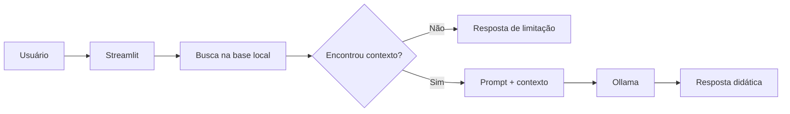

# 🐍 PyMentor

Assistente virtual para ajudar quem está começando a estudar Python.

Eu escolhi esse tema porque foi uma dificuldade que apareceu no meu próprio estudo. Em alguns assuntos eu entendia a explicação da aula, mas travava quando precisava aplicar sozinho em um exercício. A ideia do PyMentor é ficar no meio desse caminho: explicar com palavras mais simples, mostrar um exemplo curto e depois propor um desafio para a pessoa tentar.

Este projeto foi desenvolvido para o Lab **Construa Seu Assistente Virtual Com Inteligência Artificial**, da DIO.

## O que o PyMentor faz

O assistente foi pensado para dúvidas de nível iniciante. A base atual cobre assuntos como:

- variáveis e tipos de dados;
- `input()` e `print()`;
- f-strings;
- operadores como `%` e `//`;
- comparações e `if / elif / else`;
- strings e métodos de texto;
- listas e métodos de lista;
- fatiamento;
- `for` e `while`;
- remoção de itens duplicados;
- dicionários;
- funções;
- leitura de erros básicos.

A lógica principal é simples: antes de responder, o programa procura na base local quais assuntos têm relação com a pergunta. Só esse contexto é enviado para o modelo. Se não encontrar informação suficiente, o PyMentor informa a limitação em vez de inventar uma resposta.

## Como funciona



### Tecnologias usadas

- Python
- Streamlit
- Ollama
- JSON
- Requests

Não usei banco de dados nem framework de agentes. Para esta primeira versão preferi deixar o fluxo visível e fácil de entender.

## Estrutura

```text
pymentor/
├── data/
│   ├── conceitos_python.json
│   ├── erros_comuns.json
│   └── exercicios.json
├── docs/
│   ├── 01-documentacao-agente.md
│   ├── 02-base-conhecimento.md
│   ├── 03-prompts.md
│   ├── 04-metricas.md
│   └── 05-pitch.md
├── src/
│   ├── app.py
│   ├── avaliar.py
│   └── core.py
├── tests/
│   ├── casos_seguranca.json
│   ├── casos_teste.json
│   └── resultado_avaliacao.txt
├── requirements.txt
└── README.md
```

## Como executar

### 1. Criar um ambiente virtual

No Windows:

```bash
python -m venv .venv
.venv\Scripts\activate
```

### 2. Instalar as dependências

```bash
pip install -r requirements.txt
```

### 3. Instalar e preparar o Ollama

Depois de instalar o Ollama, baixe o modelo usado por padrão:

```bash
ollama pull llama3.2:3b
```

Se o Ollama não estiver rodando, abra o aplicativo ou use:

```bash
ollama serve
```

### 4. Iniciar o PyMentor

```bash
streamlit run src/app.py
```

O navegador deve abrir a interface do chatbot.

> Se o Ollama não estiver disponível, a aplicação continua abrindo em modo de demonstração e responde diretamente com os textos da base local. Esse modo serve para testar a interface e a recuperação de conteúdo, mas não usa geração por IA.

## Exemplo de uso

**Pergunta**

```text
Não entendi para que serve o % em Python.
```

**Comportamento esperado**

O PyMentor procura o tópico sobre resto da divisão, envia esse conteúdo como contexto para o modelo e pede uma explicação voltada para iniciantes. Depois pode sugerir um exercício simples usando números pares e ímpares.

Outro exemplo:

```text
Como está o tempo hoje?
```

Nesse caso ele não encontra um tópico válido na base e deve responder que esse assunto está fora do que o projeto cobre.

## Testes

Criei um teste automático para validar duas partes que considero importantes nesta versão:

1. se a busca encontra o tópico correto para uma dúvida de Python;
2. se perguntas claramente fora do escopo ficam sem contexto e recebem a resposta de limitação.

Para executar:

```bash
python src/avaliar.py
```

Resultado obtido com os casos atuais:

```text
Recuperação top-1: 20/20 (100.0%)
Segurança de escopo: 5/5 (100.0%)
Total automatizado: 25/25 (100.0%)
```

Esse resultado mede a parte determinística do projeto, não significa que toda resposta gerada por um LLM será perfeita. A avaliação das respostas em linguagem natural continua precisando de teste manual.

## Etapas do desafio

- [x] Documentação do agente
- [x] Base de conhecimento
- [x] Prompts
- [x] Aplicação funcional
- [x] Avaliação e métricas
- [x] Pitch

A documentação de cada etapa está na pasta [`docs/`](docs/).

## Próximas melhorias

Algumas coisas que eu gostaria de testar depois:

- aumentar a quantidade de assuntos na base;
- permitir que a pessoa escolha o nível da explicação;
- salvar progresso dos desafios;
- criar uma busca semântica usando embeddings;
- adicionar testes manuais com outras pessoas iniciantes em Python.

## Referências do desafio

- Repositório base da DIO: https://github.com/digitalinnovationone/dio-lab-bia-do-futuro
- Repositório de exemplo (Edu): https://github.com/falvojr/dio-lab-bia-do-futuro

## Autor

**Debson Weverton**
