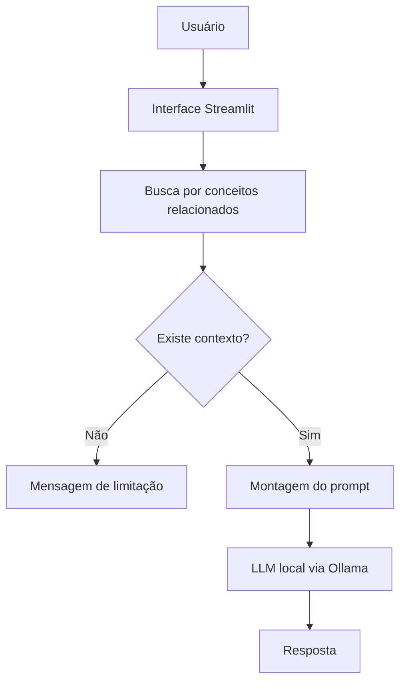

# 1. Documentação do Agente

## Caso de uso

### Problema

Quando comecei a estudar Python, percebi que entender uma explicação e conseguir resolver um exercício sozinho são duas coisas diferentes. Em alguns assuntos básicos, uma dúvida pequena acaba travando o restante do exercício. Procurar respostas na internet também pode trazer exemplos muito mais avançados do que o necessário para quem ainda está no começo.

O problema que escolhi trabalhar foi esse: **dar apoio rápido para dúvidas de Python iniciante sem transformar o assistente em um gerador de respostas prontas para tudo**.

### Solução

O PyMentor recebe uma dúvida, procura primeiro os assuntos relacionados em uma base de conhecimento local e usa somente esse conteúdo como contexto para montar a resposta.

A resposta deve:

- explicar o conceito com linguagem simples;
- usar exemplos pequenos;
- apontar erros quando a pessoa enviar um código;
- oferecer um desafio depois da explicação quando fizer sentido;
- admitir quando a base ainda não tem informação suficiente.

### Público-alvo

Pessoas que estão começando a estudar Python e ainda estão desenvolvendo segurança com lógica de programação e sintaxe básica.

## Persona e tom de voz

### Nome

**PyMentor**

Escolhi o nome juntando Python com a ideia de mentor, mas sem tentar fazer o agente parecer um professor formal.

### Comportamento

O agente deve ser didático e direto. A intenção não é responder com textos enormes. Se uma explicação puder ser feita com um exemplo de cinco linhas, ele deve preferir isso a mostrar uma solução muito maior.

Quando houver um erro em código, o PyMentor deve tentar mostrar primeiro **onde está o problema e por que acontece**. Só depois vem a correção.

### Tom de comunicação

- português do Brasil;
- informal, mas sem exagerar em gírias;
- explicações de iniciante para iniciante;
- termos técnicos são usados quando ajudam, mas precisam ser explicados.

### Exemplos de linguagem

**Saudação:**

> Oi! Manda sua dúvida de Python. Se tiver um código que não funcionou, pode mandar também.

**Explicando um conceito:**

> O `%` devolve o resto de uma divisão. Em `10 % 3`, o resultado é `1`, porque sobra 1 depois da divisão.

**Quando falta informação:**

> Minha base ainda não tem conteúdo suficiente para responder isso com segurança.

## Arquitetura

### Componentes

| Componente | Função |
|---|---|
| Streamlit | Interface de conversa |
| `core.py` | Carregamento da base, busca, prompt e integração |
| JSON | Armazena conceitos, exercícios e erros comuns |
| Ollama | Executa o modelo de linguagem localmente |
| `avaliar.py` | Testa recuperação de contexto e escopo |

## Estratégia contra respostas inventadas

A principal decisão do projeto foi não mandar toda a base para o modelo e nem deixar qualquer pergunta seguir direto para a IA.

O fluxo é:

1. a pergunta passa pela busca local;
2. os tópicos mais relacionados são selecionados;
3. esses tópicos entram no prompt como contexto;
4. se nenhum tópico atingir a pontuação mínima, o modelo nem precisa ser consultado;
5. o system prompt também orienta o agente a não inventar informação ausente.

Essa abordagem não elimina completamente erros de uma LLM, mas diminui bastante o espaço para respostas fora do material usado pelo projeto.

## Limitações

O PyMentor não foi criado para:

- substituir um curso completo de Python;
- responder assuntos gerais que não sejam Python básico;
- executar o código enviado pelo usuário;
- garantir que todo código fornecido esteja correto sem teste;
- ensinar bibliotecas avançadas nesta primeira versão;
- entregar automaticamente a resposta de todo exercício sem tentar ensinar o raciocínio primeiro.
